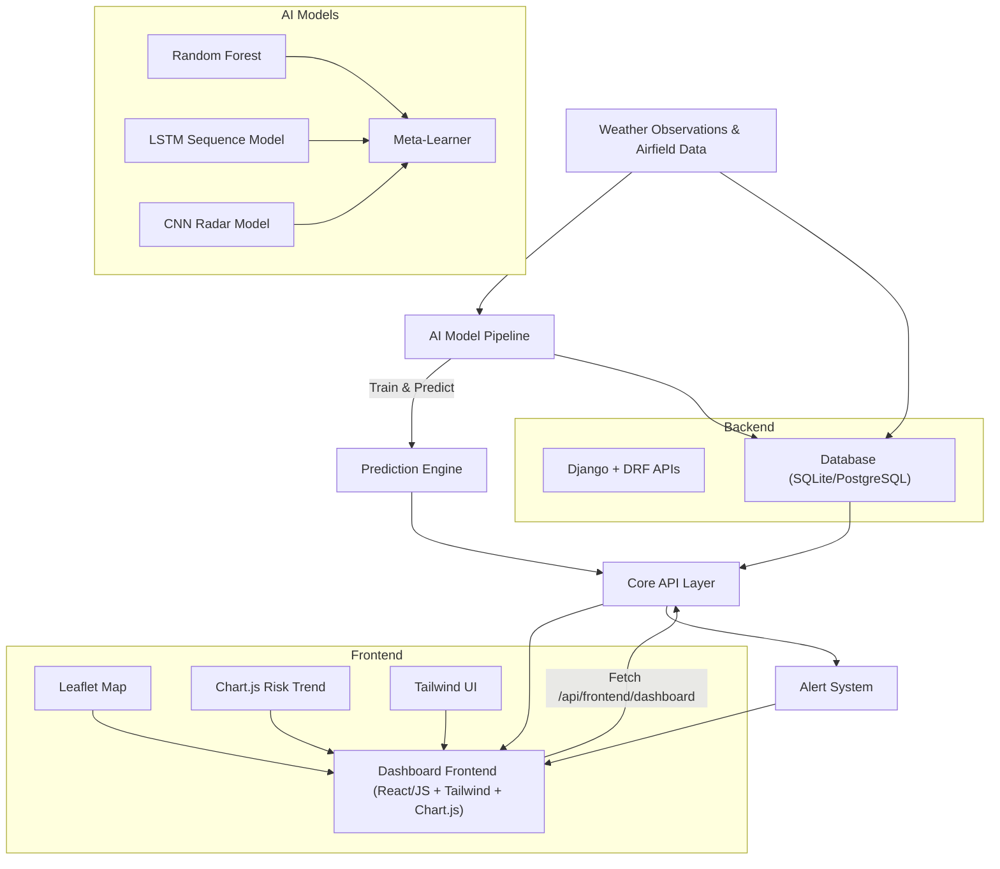

# AirfieldShield

**AI-Driven Airfield Weather Prediction and Alert System**

AirfieldShield is an intelligent nowcasting and risk-forecasting system designed to assist aviation and weather monitoring authorities in early detection of severe conditions such as thunderstorms, gale winds, and heavy rainfall near airfields.  
It uses ensemble AI/ML models (Random Forest, LSTM, CNN, and a Meta-Learner) trained on weather observations, radar imagery, and atmospheric data to generate real-time predictions and visualize them through an interactive dashboard.

---

## Table of Contents
- [Overview](#overview)
- [Features](#features)
- [System Architecture](#system-architecture)
- [Technical Stack](#technical-stack)
- [Project Structure](#project-structure)
- [Installation](#installation)
- [Training the AI Model](#training-the-ai-model)
- [Running the System](#running-the-system)
- [Dashboard Overview](#dashboard-overview)
- [Data Flow](#data-flow)
- [Results](#results)
- [Future Scope](#future-scope)
- [Author](#author)
- [License](#license)

---

## Overview

AirfieldShield is a full-stack Django project integrating machine learning for aviation weather risk assessment.  
It predicts and visualizes potential hazards such as **thunderstorms** and **gale winds** based on recent weather data.  
The dashboard provides a real-time view of:
- Active alerts with severity levels.
- Recent predictions and their probabilities.
- A live map showing simulated storm activity.
- Risk trend charts and current weather parameters.

---

## Features

- **AI-Based Nowcasting:**  
  Predicts short-term risks for thunderstorms and gale winds.

- **Interactive Dashboard:**  
  Real-time visualization using Leaflet (map), Chart.js (risk trends), and Tailwind CSS (UI).

- **Ensemble Machine Learning Pipeline:**  
  Combines RandomForest (tabular), LSTM (sequential), CNN (image-based radar), and a meta-learner for final inference.

- **Storm Simulation Layer:**  
  Displays synthetic radar-like storm movement around airfields.

- **Auto-Refresh Mechanism:**  
  Continuously updates dashboard data and chart trends without page reloads.

- **Alert Management System:**  
  Generates and displays severity-based alerts (Green, Orange, Red) using Django models.

- **Modular Architecture:**  
  Each component (AI, core APIs, alerts, dashboard UI) is a separate Django app for scalability.

---

## System Architecture



---

## Technical Stack

**Backend:**  
- Python 3.12  
- Django 5.x  
- Django REST Framework  
- TensorFlow, scikit-learn, NumPy, Pandas  
- Joblib (for model serialization)

**Frontend:**  
- HTML, Tailwind CSS, JavaScript  
- Chart.js (for risk trend charts)  
- Leaflet.js (for interactive maps)

**Database:**  
- SQLite (development)  
- PostgreSQL (recommended for production)

**Deployment Tools:**  
- Git / GitHub  
- Gunicorn / Nginx (for deployment)  
- Docker (optional)

---

## Project Structure

```bash
airfieldshield/
├── ai_models/                     # ML training & prediction logic
│   ├── management/commands/
│   │   ├── train_ensemble.py      # Ensemble model training
│   │   ├── predict.py             # Prediction generation
│   │   ├── pipeline.py            # Full training + prediction pipeline
│   └── trained/                   # Saved models (.joblib, .keras)
│
├── alerts/                        # Alerts generation & acknowledgment APIs
│   ├── management/commands/run_alerts.py
│   ├── models.py
│   ├── views.py
│   └── urls.py
│
├── core/                          # Main APIs & data models
│   ├── api.py                     # Dashboard & history APIViews
│   ├── urls.py                    # /api/... endpoints
│   ├── views.py                   # DRF viewsets for Airfield, WeatherObservation, etc.
│   ├── models.py
│   └── management/commands/
│
├── dashboard/                     # Frontend UI & static dashboard
│   ├── templates/dashboard/home.html
│   ├── urls.py
│   └── views.py
│
├── manage.py
├── requirements.txt
└── README.md
```

---

## Installation

```bash
# 1. Clone the repository
git clone https://github.com/dhruvindave007/AIrfieldShield.git
cd AIrfieldShield

# 2. Create virtual environment
python3 -m venv venv
source venv/bin/activate   # On Windows: venv\Scripts\activate

# 3. Install dependencies
pip install -r requirements.txt

# 4. Apply migrations
python manage.py migrate

# 5. Create a superuser (optional for admin panel)
python manage.py createsuperuser

# 6. Run the development server
python manage.py runserver
```

Open your browser at [http://127.0.0.1:8000](http://127.0.0.1:8000)

---

## Training the AI Model

AirfieldShield includes a single-command training and prediction pipeline.

```bash
python manage.py pipeline --samples 8000 --seq-len 30 --epochs 8 --batch 64
```

This performs:
1. Synthetic data generation for model training.  
2. Training of ensemble models: RandomForest, LSTM, CNN.  
3. Creation of meta-learner (logistic regression).  
4. Automatic prediction generation and saving to DB.  
5. Refresh of alerts and dashboard data.

All trained models are stored in `ai_models/trained/`.

---

## Running the System

Start the local Django server:
```bash
python manage.py runserver
```

Visit the dashboard:
```
http://127.0.0.1:8000/
```

APIs can be tested via:
```
/api/frontend/dashboard/?airfield=TEST
/api/predictions/history/?airfield=TEST&hours=6
```

If you need to refresh alerts manually:
```bash
python manage.py run_alerts
```

---

## Dashboard Overview

The web dashboard provides:
- **Active Alerts Panel** — Lists all unacknowledged alerts with severity color codes.  
- **Prediction Cards** — Displays recent AI-generated risk probabilities.  
- **Storm Activity Map** — Shows simulated storm centers and movement using Leaflet.  
- **Risk Trend Chart** — Interactive time-series chart showing Thunderstorm and Gale risk percentages over time.  
- **Current Weather Summary** — Displays temperature, humidity, pressure, wind speed, and radar intensity.  
- **Auto Refresh** — Every 10 seconds (configurable), data and charts update seamlessly.

---

## Data Flow

1. `WeatherObservation` and `Airfield` data are stored in the database.  
2. The **AI Ensemble Pipeline** processes input sequences, tabular data, and synthetic radar arrays.  
3. Predictions are written to the `Prediction` table.  
4. The **Alerts Engine** evaluates those predictions and issues new alerts based on thresholds.  
5. The **Dashboard Frontend** fetches `/api/frontend/dashboard/` and `/api/predictions/history/` every few seconds to render the map and charts.

---

## Results

Below are placeholders for screenshots that demonstrate system functionality:

| Feature | Screenshot |
|----------|-------------|
| Dashboard Overview |  | 
| Storm Activity Map |  |
| AI Risk Trend Chart |  |
| Active Alerts |  |


---

## Future Scope

- Integration with live open-source weather APIs (e.g., Open-Meteo, NOAA, OpenWeatherMap).  
- Satellite radar imagery integration for real radar-based CNN model inputs.  
- Real-time weather station connectivity and IoT sensor feeds.  
- Advanced anomaly detection and probabilistic ensemble calibration.  
- Integration with ATC/aviation communication networks for automated alert delivery.  
- Cloud deployment with load-balanced model inference microservices.

---

## Author

**Dhruvin Krutarthkumar Dave**  
- Location: Ahmedabad, Gujarat, India  
- Email: [davedhruvin307@gmail.com](mailto:davedhruvin307@gmail.com)  
- LinkedIn: [www.linkedin.com/in/mrdhruvindave](https://www.linkedin.com/in/mrdhruvindave)
- Instagram: [www.instagram.com/davedhruvin07](https://www.instagram.com/davedhruvin07)

---

## License

This project is licensed under the **MIT License** – see the [LICENSE](LICENSE) file for details.

