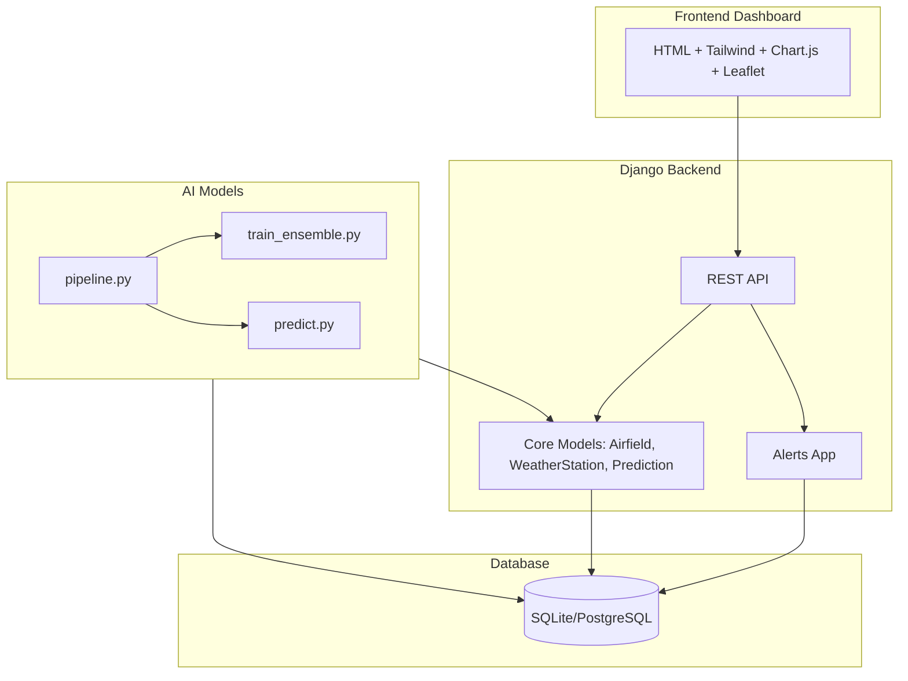

# AirfieldShield

AirfieldShield is an AI-powered weather nowcasting and alerting system designed to help airfields predict and visualize severe weather events such as thunderstorms and gale winds.

It combines synthetic + AI/ML models with a modern interactive dashboard that provides:
- Real-time predictions
- Storm overlays on a map
- Risk trend charts
- Alerts and data-source health monitoring

---

## Features

- Thunderstorm & Gale Prediction using Random Forest, LSTM, CNN, and an Ensemble Meta-learner
- Storm Visualization with animated markers and polygons on an interactive map
- Detailed Risk Trend Chart (6h history with probabilities)
- Active Alerts Dashboard (with severity levels: RED / ORANGE / GREEN)
- Live Weather Summary (temperature, humidity, pressure, wind, radar intensity)
- Data Source Health Check (WeatherAPI, RadarFeed, Prediction Engine)
- Auto-refresh every 10s with manual refresh controls
- Map Controls (zoom to airfield, toggle storms)

---

## Tech Stack

- Backend: Django REST Framework (Python)
- AI/ML Models: Scikit-learn, TensorFlow/Keras, NumPy
- Frontend Dashboard: HTML, Tailwind CSS, Chart.js, Leaflet.js
- Database: SQLite (default) — can be upgraded to PostgreSQL
- Deployment Ready: Can be containerized (Docker) or deployed to any Django-compatible hosting

---

## Project Structure

```text
airfieldshield/
├── core/                  → Airfield, WeatherStation, Prediction models
├── ai_models/             → AI training & prediction logic
│   └── management/commands/
│       ├── train_ensemble.py   → Train ensemble models (RF + LSTM + CNN)
│       ├── predict.py          → Run predictions
│       └── pipeline.py         → One-click training + prediction pipeline
├── alerts/                → Alert models and refresh logic
├── templates/             → Frontend templates (dashboard)
├── static/                → Static files (CSS, JS, etc.)
├── manage.py
└── README.md
````

---

## Getting Started

```bash
# 1. Clone Repository
git clone https://github.com/dhruvindave007/AIrfieldShield.git
cd AIrfieldShield

# 2. Create Virtual Environment
python -m venv venv
source venv/bin/activate   # Linux/Mac
venv\Scripts\activate      # Windows

# 3. Install Requirements
pip install -r requirements.txt

# 4. Run Migrations
python manage.py makemigrations
python manage.py migrate

# 5. Create Superuser (Admin)
python manage.py createsuperuser

# 6. Train Models + Generate Predictions (One Pipeline)
python manage.py pipeline --samples 8000 --seq-len 30 --epochs 10 --batch 64

# 7. Run Development Server
python manage.py runserver
```

Access at [http://127.0.0.1:8000/](http://127.0.0.1:8000/)

---

## Dashboard Overview

* Storm Activity Map → real-time animated storm cells
* Risk Trend Chart → 6-hour rolling predictions for thunderstorm & gale wind
* Active Alerts Panel → severity-based alerts (RED, ORANGE, GREEN)
* Latest Predictions → probability progress bars with confidence levels
* Weather Summary → temperature, humidity, pressure, wind, radar

---

## Example Commands

```bash
# Train only AI models
python manage.py train_ensemble --samples 5000 --seq-len 30 --epochs 8

# Run predictions
python manage.py predict

# Refresh alerts
python manage.py run_alerts
```

---

## System Architecture


```mermaid
flowchart TD
    subgraph Frontend [Frontend Dashboard]
        UI[HTML + Tailwind + Chart.js + Leaflet]
    end

    subgraph Backend [Django Backend]
        API[REST API]
        Alerts[Alerts App]
        Core[Core Models: Airfield, WeatherStation, Prediction]
    end

    subgraph AI [AI Models]
        Train[train_ensemble.py]
        Predict[predict.py]
        Pipeline[pipeline.py]
    end

    subgraph Database [Database]
        DB[(SQLite/PostgreSQL)]
    end

    UI --> API
    API --> Core
    API --> Alerts
    Core --> DB
    Alerts --> DB
    AI --> Core
    AI --> DB
    Pipeline --> Train
    Pipeline --> Predict
```

---

## Contribution

1. Fork the repository
2. Create your feature branch

   ```bash
   git checkout -b feature/new-feature
   ```
3. Commit changes

   ```bash
   git commit -m 'Add some feature'
   ```
4. Push to branch

   ```bash
   git push origin feature/new-feature
   ```
5. Create a Pull Request

---

## License

This project is licensed under the MIT License.
You are free to use, modify, and distribute with attribution.

---

## Author & Contact

**Dhruvin Krutarthkumar Dave**
Ahmedabad, Gujarat, India
## Email: [davedhruvin307@gmail.com](mailto:davedhruvin307@gmail.com)
## LinkedIn: [www.linkedin.com/in/mrdhruvindave](https://www.linkedin.com/in/mrdhruvindave)
## GitHub: [dhruvindave007](https://github.com/dhruvindave007)
