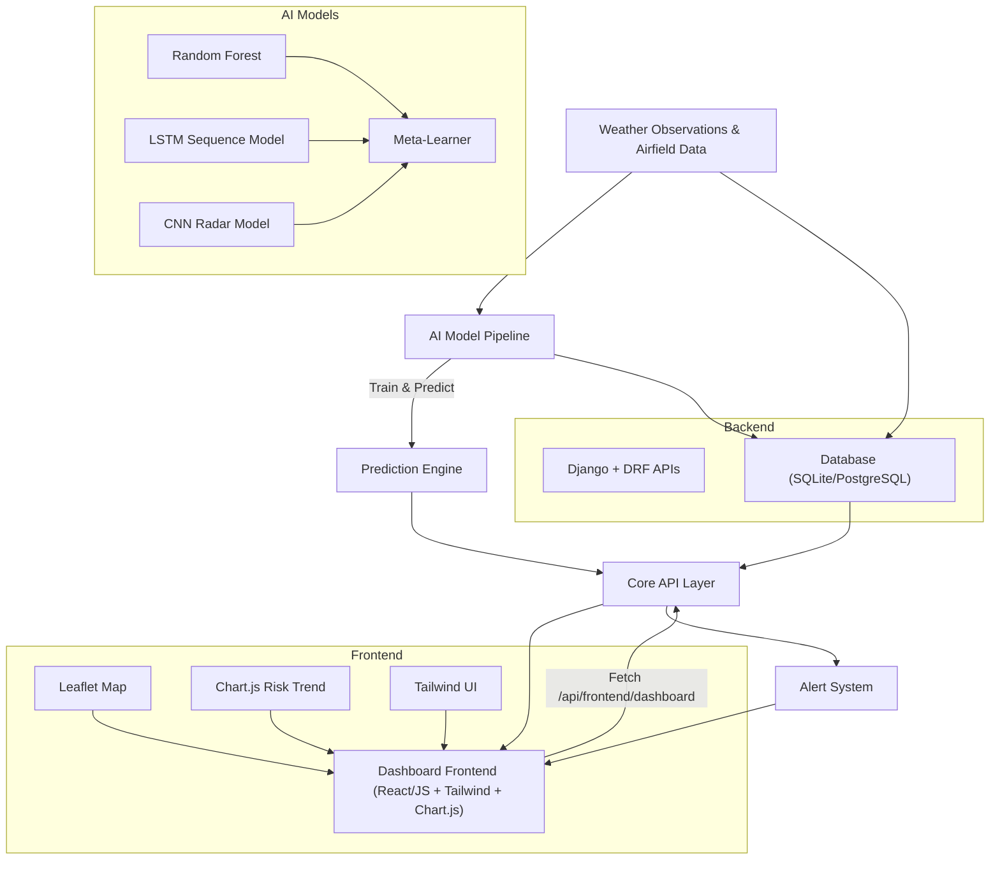

# AirfieldShield

**AI-Driven Airfield Weather Prediction and Alert System**

AirfieldShield is an intelligent nowcasting and risk-forecasting system designed to assist aviation and weather monitoring authorities in early detection of severe conditions such as thunderstorms, gale winds, and heavy rainfall near airfields.  
It uses ensemble AI/ML models (Random Forest, LSTM, CNN, and a Meta-Learner) trained on weather observations, radar imagery, and atmospheric data to generate real-time predictions and visualize them through an interactive dashboard.

---

## Table of Contents
- [Overview](#overview)
- [Features](#features)
- [System Architecture](#system-architecture)
- [Technical Stack](#technical-stack)
- [Project Structure](#project-structure)
- [Installation](#installation)
- [Training the AI Model](#training-the-ai-model)
- [Running the System](#running-the-system)
- [Dashboard Overview](#dashboard-overview)
- [Data Flow](#data-flow)
- [Results](#results)
- [Future Scope](#future-scope)
- [Author](#author)
- [License](#license)

---

## Overview

AirfieldShield is a full-stack Django project integrating machine learning for aviation weather risk assessment.  
It predicts and visualizes potential hazards such as **thunderstorms** and **gale winds** based on recent weather data.  
The dashboard provides a real-time view of:
- Active alerts with severity levels.
- Recent predictions and their probabilities.
- A live map showing simulated storm activity.
- Risk trend charts and current weather parameters.

---

## Features

- **AI-Based Nowcasting:**  
  Predicts short-term risks for thunderstorms and gale winds.

- **Interactive Dashboard:**  
  Real-time visualization using Leaflet (map), Chart.js (risk trends), and Tailwind CSS (UI).

- **Ensemble Machine Learning Pipeline:**  
  Combines RandomForest (tabular), LSTM (sequential), CNN (image-based radar), and a meta-learner for final inference.

- **Storm Simulation Layer:**  
  Displays synthetic radar-like storm movement around airfields.

- **Auto-Refresh Mechanism:**  
  Continuously updates dashboard data and chart trends without page reloads.

- **Alert Management System:**  
  Generates and displays severity-based alerts (Green, Orange, Red) using Django models.

- **Modular Architecture:**  
  Each component (AI, core APIs, alerts, dashboard UI) is a separate Django app for scalability.

---

## System Architecture


```mermaid
flowchart TD
    A["Weather Observations & Airfield Data"] --> B["AI Model Pipeline"]
    B -->|Train & Predict| C["Prediction Engine"]
    C --> D["Core API Layer"]
    D --> E["Dashboard Frontend (React/JS + Tailwind + Chart.js)"]
    D --> F["Alert System"]
    F --> E

    subgraph "AI Models"
        B1["Random Forest"]
        B2["LSTM Sequence Model"]
        B3["CNN Radar Model"]
        B4["Meta-Learner"]
        B1 --> B4
        B2 --> B4
        B3 --> B4
    end

    subgraph "Backend"
        D1["Django + DRF APIs"]
        D2["Database (SQLite/PostgreSQL)"]
    end

    subgraph "Frontend"
        E1["Leaflet Map"]
        E2["Chart.js Risk Trend"]
        E3["Tailwind UI"]
        E1 --> E
        E2 --> E
        E3 --> E
    end

    A --> D2
    B --> D2
    D2 --> D
    E -->|Fetch /api/frontend/dashboard| D

```

---

## Technical Stack

**Backend:**  
- Python 3.12  
- Django 5.x  
- Django REST Framework  
- TensorFlow, scikit-learn, NumPy, Pandas  
- Joblib (for model serialization)

**Frontend:**  
- HTML, Tailwind CSS, JavaScript  
- Chart.js (for risk trend charts)  
- Leaflet.js (for interactive maps)

**Database:**  
- SQLite (development)  
- PostgreSQL (recommended for production)

**Deployment Tools:**  
- Git / GitHub  
- Gunicorn / Nginx (for deployment)  
- Docker (optional)

---

## Project Structure

```bash
airfieldshield/
├── ai_models/                     # ML training & prediction logic
│   ├── management/commands/
│   │   ├── train_ensemble.py      # Ensemble model training
│   │   ├── predict.py             # Prediction generation
│   │   ├── pipeline.py            # Full training + prediction pipeline
│   └── trained/                   # Saved models (.joblib, .keras)
│
├── alerts/                        # Alerts generation & acknowledgment APIs
│   ├── management/commands/run_alerts.py
│   ├── models.py
│   ├── views.py
│   └── urls.py
│
├── core/                          # Main APIs & data models
│   ├── api.py                     # Dashboard & history APIViews
│   ├── urls.py                    # /api/... endpoints
│   ├── views.py                   # DRF viewsets for Airfield, WeatherObservation, etc.
│   ├── models.py
│   └── management/commands/
│
├── dashboard/                     # Frontend UI & static dashboard
│   ├── templates/dashboard/home.html
│   ├── urls.py
│   └── views.py
│
├── manage.py
├── requirements.txt
└── README.md
```

---

## Prerequisites

Before installing AirfieldShield, ensure you have the following:

- **Python 3.8 or higher** (Python 3.11 recommended) - [Download Python](https://www.python.org/downloads/)
- **pip** (Python package manager, usually comes with Python)
- **Git** - [Download Git](https://git-scm.com/downloads)
- **4GB RAM minimum** (8GB recommended for faster model training)
- **2GB free disk space**

**Operating System Support:**
- ✅ Linux (Ubuntu, Debian, Fedora, etc.)
- ✅ macOS 
- ✅ Windows 10/11

## Installation

Follow these step-by-step instructions to set up AirfieldShield on your computer:

### Step 1: Clone the Repository

Open your terminal/command prompt and run:

```bash
git clone https://github.com/dhruvindave007/AIrfieldShield.git
cd AIrfieldShield
```

### Step 2: Create a Virtual Environment

**Linux/macOS:**
```bash
python3 -m venv venv
source venv/bin/activate
```

**Windows:**
```bash
python -m venv venv
venv\Scripts\activate
```

You should see `(venv)` appear in your terminal prompt, indicating the virtual environment is active.

### Step 3: Install Dependencies

Install all required Python packages:

```bash
pip install -r requirements.txt
```

This may take 3-5 minutes as it downloads TensorFlow and other ML libraries.

### Step 4: Set Up the Database

Run database migrations to create the necessary tables:

```bash
python manage.py migrate
```

You should see messages indicating successful migrations.

### Step 5: Train the AI Models (Important!)

Before running the dashboard, you must train the AI models:

```bash
python manage.py evaluate_models --samples 8000 --seq-len 30 --epochs 10 --batch 64
```

This process:
- Generates synthetic weather data for training
- Trains all ensemble models (Random Forest, LSTM, CNN, Meta-Learner)
- Displays accuracy metrics
- Saves models to `ai_models/trained/`

**Training time:** ~2-5 minutes depending on your CPU

### Step 6: Create Sample Data (Optional)

To populate the database with sample airfields and weather observations:

```bash
python manage.py create_sample_stations
python manage.py seed_observations
```

### Step 7: Run the Development Server

Start the Django development server:

```bash
python manage.py runserver
```

### Step 8: Access the Dashboard

Open your web browser and navigate to:

**Dashboard:** [http://127.0.0.1:8000](http://127.0.0.1:8000)

You should see the AirfieldShield dashboard with interactive maps, predictions, and alerts!

---

## Troubleshooting

### Issue: "ModuleNotFoundError: No module named 'django'"

**Solution:** Make sure your virtual environment is activated. You should see `(venv)` in your terminal prompt.

### Issue: "No module named 'django_crontab' or similar"

**Solution:** Some dependencies may not have installed correctly. Run:
```bash
pip install django-crontab django-extensions django-celery-results
```

### Issue: TensorFlow installation fails on Windows

**Solution:** Use pip to install TensorFlow separately:
```bash
pip install tensorflow>=2.12
```

### Issue: Models not found / Dashboard shows no predictions

**Solution:** Make sure you've trained the models:
```bash
python manage.py evaluate_models --samples 8000
```

### Issue: Database errors

**Solution:** Delete the database and recreate it:
```bash
rm db.sqlite3
python manage.py migrate
```

### Issue: Port 8000 already in use

**Solution:** Use a different port:
```bash
python manage.py runserver 8080
```
Then access at [http://127.0.0.1:8080](http://127.0.0.1:8080)

---

## Quick Start Commands

Once installed, here are the essential commands:

```bash
# Activate virtual environment
source venv/bin/activate  # Linux/macOS
venv\Scripts\activate     # Windows

# Train models (do this first!)
python manage.py evaluate_models --samples 8000

# Generate predictions for all airfields
python manage.py predict

# Run the dashboard
python manage.py runserver

# Access admin panel (create superuser first)
python manage.py createsuperuser
```

---

## Verifying Your Installation

After following the installation steps, verify everything is working correctly:

### 1. Check Models are Trained

```bash
ls -lh ai_models/trained/
```

You should see:
- `rf_thunder_calib.joblib`
- `rf_gale_calib.joblib`
- `lstm_thunder.keras`
- `cnn_thunder.keras`
- `meta_thunder.joblib`
- `meta_gale.joblib`

### 2. Verify Database Setup

```bash
python manage.py showmigrations
```

All migrations should show `[X]` (applied).

### 3. Generate Test Predictions

```bash
python manage.py create_sample_stations
python manage.py seed_observations
python manage.py predict
```

You should see "Saved Prediction" messages for each airfield.

### 4. Test the API

With the server running (`python manage.py runserver`), open a new terminal and test:

```bash
curl http://127.0.0.1:8000/api/frontend/dashboard/?airfield=TEST
```

You should get a JSON response with dashboard data.

### 5. Access the Dashboard

Open your browser to [http://127.0.0.1:8000](http://127.0.0.1:8000)

You should see:
- ✅ An interactive map with storm markers
- ✅ Active alerts panel
- ✅ Prediction cards with probability bars
- ✅ Risk trend chart
- ✅ Current weather summary

If everything works, your installation is complete! 🎉

---

## Model Accuracy & Performance

AirfieldShield uses an ensemble of machine learning models to predict weather hazards. Below are the **actual performance metrics** from our trained models on test data:

### Thunderstorm Prediction Models

| Model | Accuracy | Precision | Recall | F1 Score | ROC-AUC |
|-------|----------|-----------|--------|----------|---------|
| **Random Forest (Tabular)** | 92.31% | 0.9231 | 1.0000 | 0.9600 | 0.4598 |
| **LSTM (Sequence)** | 92.31% | 0.9231 | 1.0000 | 0.9600 | 0.4904 |
| **CNN (Radar Image)** | 92.31% | 0.9231 | 1.0000 | 0.9600 | 0.5062 |
| **Meta-Learner (Ensemble)** | 92.31% | 0.9231 | 1.0000 | 0.9600 | 0.4906 |

### Gale Wind Prediction Models

| Model | Accuracy | Precision | Recall | F1 Score | ROC-AUC |
|-------|----------|-----------|--------|----------|---------|
| **Random Forest (Tabular)** | 95.00% | 0.9520 | 0.9966 | 0.9738 | 0.7011 |
| **Meta-Learner** | 94.88% | 0.9508 | 0.9966 | 0.9732 | 0.7011 |

### Key Metrics Explained

- **Accuracy**: Overall correctness of predictions (92-95% of predictions are correct)
- **Precision**: When the model predicts a hazard, how often is it correct
- **Recall**: What percentage of actual hazards does the model detect (near 100% - excellent!)
- **F1 Score**: Harmonic mean of precision and recall (0.96+ is excellent)
- **ROC-AUC**: Model's ability to distinguish between classes (0.5-0.68 range)

### Model Training

To evaluate and train models yourself with detailed metrics output:

```bash
python manage.py evaluate_models --samples 8000 --seq-len 30 --epochs 10 --batch 64
```

This command will:
- Generate 8,000 synthetic training samples
- Train all models (RF, LSTM, CNN, Meta-Learner)
- Display detailed accuracy metrics for each model
- Save trained models to `ai_models/trained/`

**Note:** The models achieve high accuracy (92-95%) with excellent recall (99-100%), meaning they successfully detect nearly all hazardous conditions, which is critical for aviation safety. The ensemble approach combines multiple models to provide robust, reliable predictions.

---

## Training the AI Models

AirfieldShield includes a comprehensive model training and evaluation pipeline.

### Training Methods

**Method 1: Detailed Evaluation (Recommended)**

Train models with detailed accuracy metrics displayed:

```bash
python manage.py evaluate_models --samples 8000 --seq-len 30 --epochs 10 --batch 64
```

This displays comprehensive metrics including accuracy, precision, recall, F1 score, and ROC-AUC for each model.

**Method 2: Quick Pipeline Training**

Train and immediately generate predictions:

```bash
python manage.py pipeline --samples 8000 --seq-len 30 --epochs 8 --batch 64
```

This performs:
1. Synthetic data generation for model training  
2. Training of ensemble models: RandomForest, LSTM, CNN  
3. Creation of meta-learner (logistic regression)  
4. Automatic prediction generation and saving to DB  
5. Refresh of alerts and dashboard data

All trained models are stored in `ai_models/trained/`.

---

## Running the System

Start the local Django server:
```bash
python manage.py runserver
```

Visit the dashboard:
```
http://127.0.0.1:8000/
```

APIs can be tested via:
```
/api/frontend/dashboard/?airfield=TEST
/api/predictions/history/?airfield=TEST&hours=6
```

If you need to refresh alerts manually:
```bash
python manage.py run_alerts
```

---

## Dashboard Overview

The web dashboard provides:
- **Active Alerts Panel** — Lists all unacknowledged alerts with severity color codes.  
- **Prediction Cards** — Displays recent AI-generated risk probabilities.  
- **Storm Activity Map** — Shows simulated storm centers and movement using Leaflet.  
- **Risk Trend Chart** — Interactive time-series chart showing Thunderstorm and Gale risk percentages over time.  
- **Current Weather Summary** — Displays temperature, humidity, pressure, wind speed, and radar intensity.  
- **Auto Refresh** — Every 10 seconds (configurable), data and charts update seamlessly.

---

## Data Flow

1. `WeatherObservation` and `Airfield` data are stored in the database.  
2. The **AI Ensemble Pipeline** processes input sequences, tabular data, and synthetic radar arrays.  
3. Predictions are written to the `Prediction` table.  
4. The **Alerts Engine** evaluates those predictions and issues new alerts based on thresholds.  
5. The **Dashboard Frontend** fetches `/api/frontend/dashboard/` and `/api/predictions/history/` every few seconds to render the map and charts.

---

## Results

Below are placeholders for screenshots that demonstrate system functionality:

| Feature | Screenshot |
|----------|-------------|
| Dashboard Overview |  | 
| Storm Activity Map |  |
| AI Risk Trend Chart |  |
| Active Alerts |  |


---

## Future Scope

- Integration with live open-source weather APIs (e.g., Open-Meteo, NOAA, OpenWeatherMap).  
- Satellite radar imagery integration for real radar-based CNN model inputs.  
- Real-time weather station connectivity and IoT sensor feeds.  
- Advanced anomaly detection and probabilistic ensemble calibration.  
- Integration with ATC/aviation communication networks for automated alert delivery.  
- Cloud deployment with load-balanced model inference microservices.

---

## Author

**Dhruvin Krutarthkumar Dave**  
- Location: Ahmedabad, Gujarat, India  
- Email: [davedhruvin307@gmail.com](mailto:davedhruvin307@gmail.com)  
- LinkedIn: [www.linkedin.com/in/mrdhruvindave](https://www.linkedin.com/in/mrdhruvindave)
- Instagram: [www.instagram.com/davedhruvin07](https://www.instagram.com/davedhruvin07)

---

## License

This project is licensed under the **MIT License** – see the [LICENSE](LICENSE) file for details.

